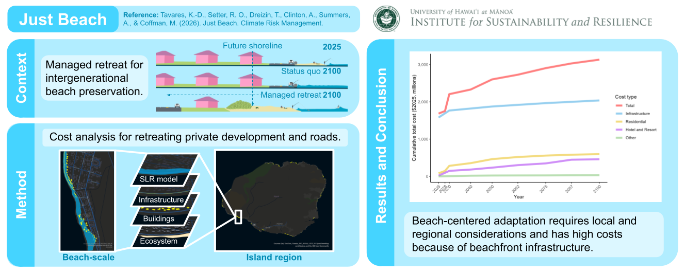

# Just beach

https://doi.org/10.1016/j.crm.2026.100790

Kammie-Dominique Tavares, Renee O. Setter, Tanya Dreizin, Alan Clinton, Alisha Summers, Makena Coffman

Sandy beaches are being squeezed out of existence due to a combination of erosion, coastal development, poor management practices, and sea level rise. This study offers a beach-scale analysis of the cost of managed retreat for the island of Kaua‘i through the end of the century, prompted by state laws to preserve sandy beaches and County efforts to implement proactive planning solutions. We estimate the cost of property acquisition, deconstruction, and infrastructural realignment across forty beaches under future projections of coastal erosion and sea level rise − a total of $3.1 billion ($2025). Half of the total costs through 2100 is for immediate (2025) needs ($1.7 billion), 94% of which is road infrastructure and the water supply pipes underneath. Infrastructure dominates the total cost of adaptation ($2.0 billion). While residential development represents the largest land use type impacted by coastal erosion, residential parcels account for the second greatest share of adaptation costs ($0.6 billion). Meanwhile, hotel and resort areas affect fewer beaches yet with substantial costs ($0.5 billion). Our results show that historical coastal planning decisions have created development lock-in patterns that make beach-centered adaptation costly. Furthermore, as achieving justice within adaptation relies on information at multiple spatial and temporal scales, this study can be used to inform broader deliberations for sea level rise adaptation.

data prep shapefiles: tmk.ipynb, Buildings.ipynb, Mahele.ipynb, Create_Base_Road.ipynb, Road.ipynb
cost analysis: 6paperfigs.R
